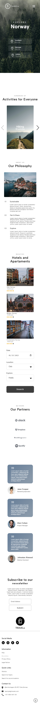

TRAVELx Landing Page

I created this landing page using HTML, CSS, SASS and a little bit of JavaScript.
The UI inspiration comes from a project found on Figma Community (https://www.figma.com/file/VHzI6vlD3QaxmLxaEJ4xy3/Travel-Landing-Page-Free-Community).

This project is among the first projects I worked on using SASS.
I used the Swiper library for the slider in the project, because it seems very important to me to be as familiar as possible with libraries that can be very helpful for the development of future projects, and Swiper is one of these libraries.
I decided to make this a travel page, but it can be modified and used for other domains as well due to the flexible design approach.

Screenshots

Desktop

Mobile

